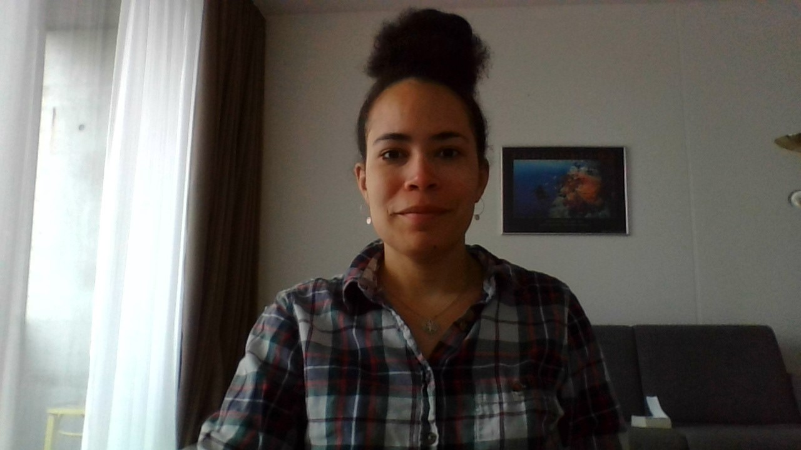

# **Why am I taking this class?**
I decided to change my career path. It is a very big step for me.
## **What is my professional background?**
I am a chronobiologist. I was studying how environmental inputs such as light and temperature are integrated by the circadian system in the brain in order to drive a synchrohnised behaviour (at a population level). My animal model was *Drosophila melanogaster*, but perhaps you will recognise this animal if I give you its usage name: the fruit fly. I have defended my PhD in 2010, so quite some time ago alreday. 
I have been working in total in 4 different countries:
+ France;
    + USA;
        + England;
            + Germany.
## **Do I have any experience in coding?**
No, not really. However in my field we are using *matlab* and *R studio* to analyse our data. Many times I felt the need to be able to write myself my own scripts. I got lucky when I was working in London that one of our PhD student knew how write scripts in *R*, which I've learned is *Python* based. I knew exactly what kind of data I wanted to extract from my raw data. together we came up with an excellent script that I was still using in my last lab here in Germany.
# **More privately**
## **fun facts**
The music I'm listening while cycling sets my mood. Rnb will make me dance on my bike, electro will make me cycle as fast as possible. I am trying to avoid listening sad music while I'm cycling. I am not using spotify to listen to my music. Rather, I'm using the french music platform called *deezer*. Here is the link: [deezer](https://www.deezer.com/en/)
## **What do I like to do?**
I like to dance. I am a social animal, and as such I like to interact with other people. I have realised however that in this very humanly cold country (Germany), I have a huge lack of social interactions. Since I have integrated a German course (3h every afternoon), I have met new people coming from different backgrounds and I loved that. I hope that with this course I will enlarge my possibilities of integrating new communities. :)
